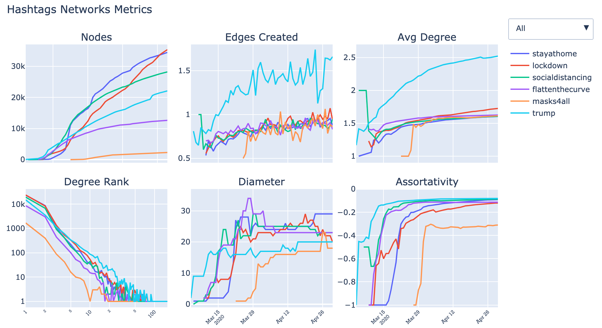

# Coronavirus (covid19) Tweets 

This dataset contains the Tweets of users who have applied the following hashtags:

#coronavirus, #coronavirusoutbreak, #coronavirusPandemic, #covid19, #covid_19, #epitwitter, #ihavecorona

The goal of this analysis is to understand Twitter discourse around COVID-19

For that reason, we'll attemp to answer the following questions:

- Do more tweets about coronavirus indicate greater public awareness and seriousness and lead to a greater public acceptance of measures to limit spread, such as social distancing, and therefore fewer infections?

- Are some hashtags spreading more rapidly than others?

- Are tweeters prone to discussion (tweet replies) or sharing (quoted tweets)?

- Are people tweeting about particular symptoms?

and we'll do it with some basic Social Network Analysis (Part 1) and NLP (Part 2)

Source: https://www.kaggle.com/smid80/coronavirus-covid19-tweets

